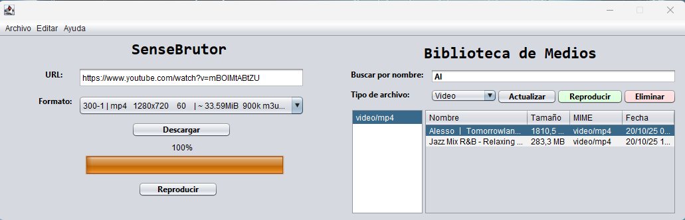

## SenseBrutor

Andreu Anglada Torres, 2 any DAM

SenseBrutor és una aplicació amb interfície gràfica (GUI) desenvolupada en Java que permet descarregar vídeos i àudios de YouTube i altres plataformes sense publicitat, utilitzant yt-dlp com a motor de descàrrega.

## Panell Login
- Pantalla d'inici de sessió (sense NetBeans Designer).
- Connexió real amb l'API DiMediaNet: https://difreenet9.azurewebsites.net
- Login amb email i contrasenya mitjançant POST a /api/Auth/login
- Emmagatzematge del token JWT per a totes les peticions posteriors.
- Casella "Recordarme" que conserva l'email i contrasenya en tancar sessió.
- Opció "Cerrar sesión" al menú Archivo que torna al panell de login i neteja les credencials.
- Tasques fetes amb Postman:
  - Registre d'usuari: andreuanglada@whatever.ever
  - Pujada de mínim 3 arxius multimèdia (ID:48, ID:49, ID:50)

    **Millores d'Usabilitat (Tarea DI04):**
    - Implementació d'un Spinner (GIF de càrrega) que s'activa durant la petició a l'API per indicar que l'aplicació està treballant.
    - Canvi dinàmic del cursor del ratolí a WAIT_CURSOR durant l'espera i a HAND_CURSOR en passar sobre el botó d'entrar.
    - Interacció millorada (Affordance):
    - Configuració de la tecla Intro com a disparador per defecte del login, permetent l'accés sense usar el ratolí.
    - Ús de Tooltips informatius als camps de text per guiar l'usuari.
    - Gestió d'errors i recuperabilitat:
    - Control d'excepcions per capturar errors de xarxa o credencials incorrectes (401), mostrant missatges clars en el statusLabel en color vermell.
    - Bloqueig del botó de login durant la càrrega per evitar duplicitat de peticions.
    - Multi-threading:
    - L'autenticació s'executa en un fil (Thread) independent per evitar que la interfície gràfica es congeli mentre s'espera la resposta del servidor Azure.

## Panell Descarrega

- Es pot afegir una URL de YouTube per començar la descàrrega.

- Un cop introduïda la URL i sortint del camp de text, l'aplicació carregarà els formats disponibles per a aquesta URL.

- Durant la càrrega, apareix un progress bar i un label que informa de l'estat de la càrrega.

- El botó Descarregar estarà desactivat fins que els formats disponibles no hagin estat completament carregats.

- Si el format seleccionat no està disponible, apareix un missatge informatiu.

- Validacions:
  - No es pot descarregar si la carpeta de sortida no està definida.
  - No es pot descarregar si no es troba l’executable `yt-dlp.exe`.
  - Missatge informatiu si l’arxiu ja està descarregat.

- Opcionalment:
  - Afegir l’arxiu a un arxiu `.m3u`.
  - Establir velocitat màxima de descàrrega.

- Un cop finalitzada la descàrrega, es mostra un botó que permet reproduir l’arxiu descarregat.

## Panell de preferències

- Seleccionar carpeta on es descarregarà l'arxiu.

- Crear arxiu .m3u, que si està marcat, a l'hora de descarregar es posarà l'arxiu dins una llista.

- Selecció de velocitat màxima de descàrrega, si es deixa a 0 no hi haurà màxim.

- Ruta on tenim l’exe per executar els comands necessaris.

## DIMediaNetPollingComponent
- Componente JavaBean desenvolupat per interactuar amb **DI Media Network**.

- Funciona com a intermediari entre la GUI i l’API REST.

- Característiques:
  - Consulta periòdica del servidor cada X segons (`pollingInterval`).
  - Manté un token JWT per autenticar les peticions.
  - Permet descarregar, pujar i obtenir informació dels fitxers remots.
  - Notifica la GUI amb **listeners** quan arriben nous fitxers remots.

## Panell Biblioteca de Medis
- Llista tots els arxius dins la carpeta de sortida, combinant fitxers locals i remots.

- Funcionalitat de **cerca en temps real** per nom.

- Filtres per:
  - Estat: `LOCAL`, `REMOTO`, `AMBOS` o **Tots**.
  - Tipus MIME (àudio, vídeo, etc.).

- Botons disponibles segons l’estat del fitxer seleccionat:

| Estat de l’arxiu | Botó principal | Acció | Botó Eliminar |
|------------------|----------------|-------|---------------|
| `LOCAL`          | Subir          | Pujar al servidor | Actiu |
| `REMOTO`         | Descargar      | Descarregar a carpeta local | Inactiu |
| `AMBOS`          | Reproducir     | Reproduir amb el reproductor per defecte | Actiu |
| Cap fitxer       | Deshabilitat   | - | Deshabilitat |

- Quan es selecciona un fitxer, els botons s’actualitzen automàticament segons l’estat.

- La taula s’actualitza automàticament:
  - Quan es descarrega un nou arxiu.
  - Quan es canvia la carpeta de sortida.

- Permet eliminar l’arxiu seleccionat localment.

- Permet reproduir l’arxiu seleccionat amb el reproductor per defecte del sistema.

- Validacions:
  - Missatge si l’arxiu no existeix localment.
  - Missatge si l’arxiu remot no existeix.
  - Missatge si el format seleccionat no és vàlid.

## Acerca de

- Conté el logo de l’aplicació.

- Nom de l’alumne, amb curs i els recursos utilitzats.

## Funcionalitats extra

- He afegit la funcionalitat de poder triar el format de sortida segons el que la URL pugui oferir.

- He afegit un progress bar que surt a l’hora de carregar els formats i a l’hora d’iniciar la descàrrega.

- He afegit validacions per si s’intenta descarregar sense tenir definida una ruta de sortida o si no tenim guardat l’arxiu ytdlp.exe.

- He afegit que si es selecciona a la taula de biblioteca de medis un arxiu, s’habiliti un botó que permet reproduir-lo.

- He afegit que una vegada es descarrega l’arxiu, s’actualitzi la pantalla “Biblioteca de Medis” amb el nou arxiu descarregat.

- He afegit que una vegada seleccionada la carpeta de sortida de descàrregues, s’actualitzi la taula “Biblioteca de Medis” mostrant tots els arxius de la carpeta.

- He afegit funcionalitat de cerca en temps real a l’hora d’escriure el nom de l’arxiu a cercar.

- He afegit que si l’arxiu ja estava descarregat surti un missatge informatiu.

- He afegit que si el format seleccionat no està disponible mostri un missatge informatiu.

- Botons de la taula actualitzats segons l’estat dels fitxers (LOCAL, REMOTO, AMBOS).

## Problemes

- No sabia gaire bé com fer per carregar els formats, m’ha duit bastant de temps però finalment ho he deixat com al principi. Una vegada es surt de posar
la URL, s’inicia la càrrega de formats.

- Problemes amb caràcters estranys o accents una vegada descarregat l’arxiu per reproduir-lo. Solucionat afegint la línia "--restrict-filenames", dins la funció d’iniciar la descàrrega.

## Recursos

- https://www.youtube.com/@spdvi7370

- https://chatgpt.com/

- https://paucasesnovescifp.cat/